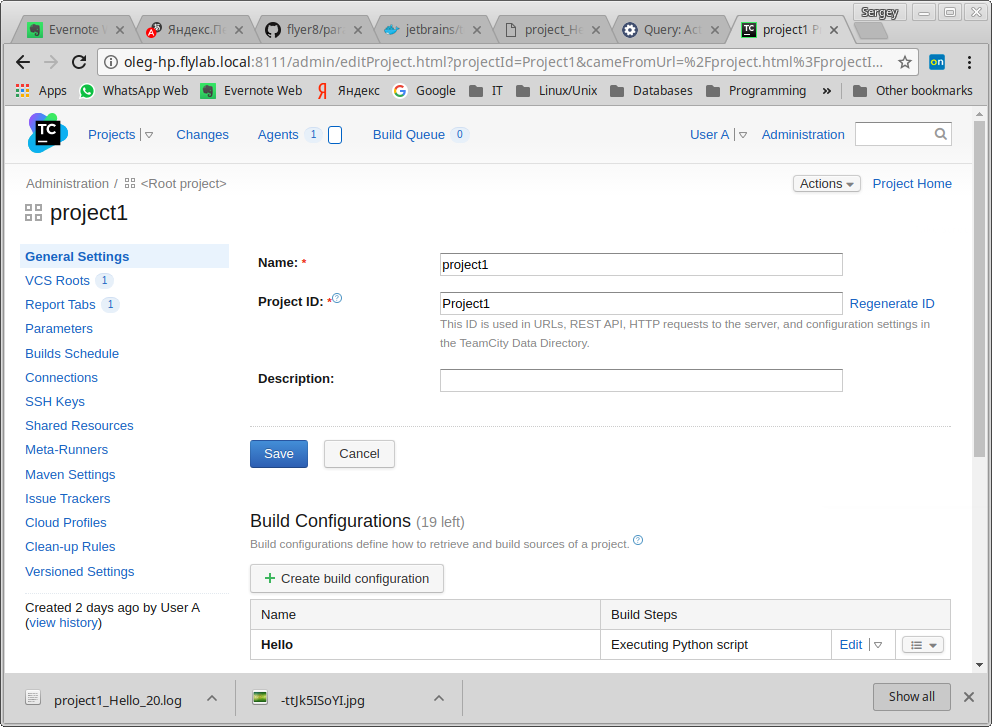
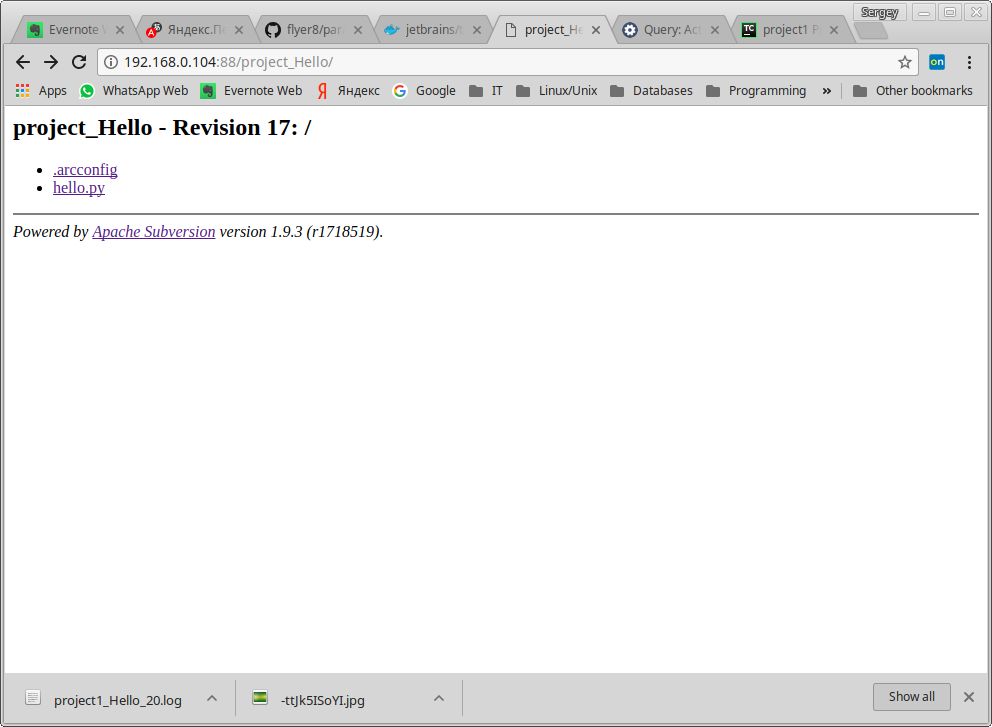
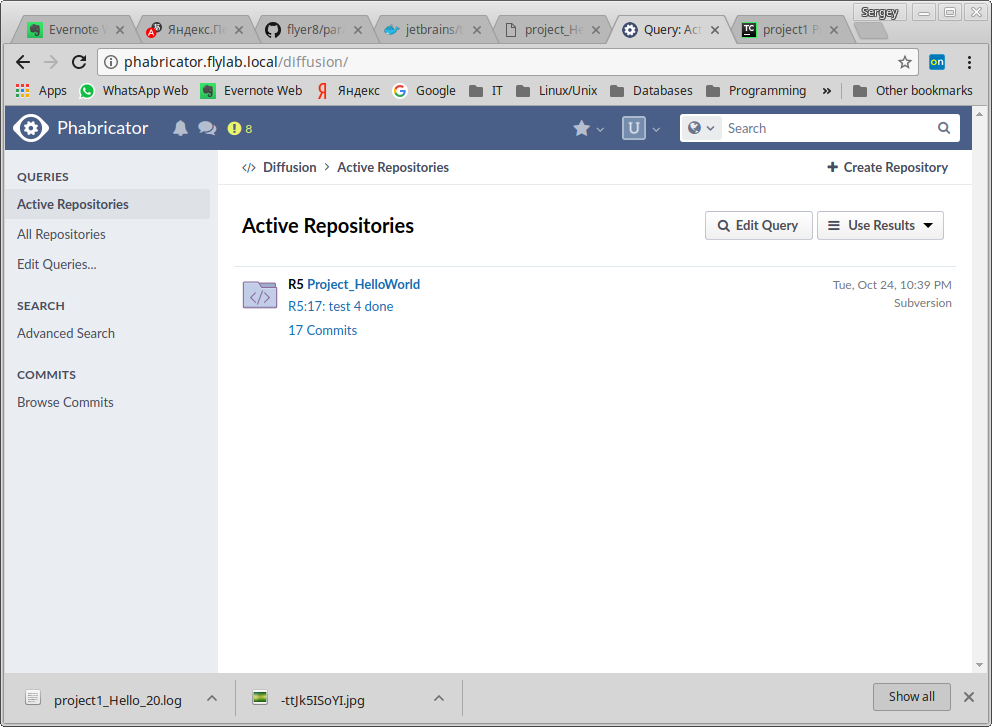

### CI/CD configuration: TeamCity | SVN | Phabricator

Please find screencast and descriptions of the task here:
https://cloud.mail.ru/public/E9Qc/Cb2SNNCZp

CI/CD infra is implemented on OS Linux Mint 18.1 with 4 GB RAM.

JetBrains TeamCity is deployed in Docker container from the official repository https://hub.docker.com/r/jetbrains/teamcity-server:
```
docker run -d -it --name teamcity-server-instance \
-v /opt/teamcity/data:/data/teamcity_server/datadir \
-v /opt/teamcity/logs:/opt/teamcity/logs \
-p 8111:8111 \
jetbrains/teamcity-server
```
Apache Subversion and Phacility Phabricator are installed on the host OS according to the official documentation using LAMP stack:
* Apache/2.4.18
* PHP 7.1.10
* MySQL 5.7.20

As the application is used Python 3 stored in the repository Subversion.
```
#!/usr/bin/env python3
# Autor: Sergey Shimanskiy
# This is test 888
print("Hello World!")
print("Hi Paragon Team, This is test task 888")
```
Screenshots:



